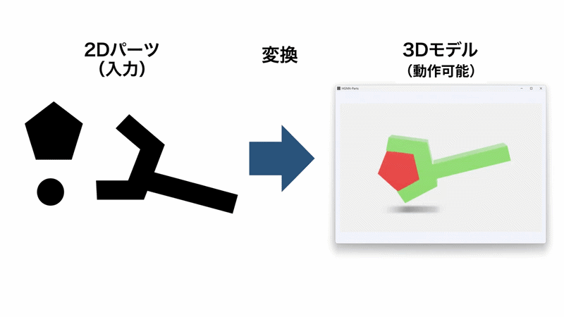

# HGNN-Parts — パーツシミュレーター

無料の3Dゲームエンジン「**Godot Engine**」を使って、3Dモデル（.glbファイル）や2D画像（.png）を取り込み、パーツを組み立てて回したり移動させたりするシミュレーションソフトです。AIに指示して作ったので、AIへの指示ミスによる動作不良があると思います。

---

<div align="center">
  
</div>

## 🌟 主な機能

### 📁 1. 3Dモデル・シーンの読み込みと保存

- **3Dモデル（.glb）の読み込み・追加**:
    - CADやBlenderなどで作成した3Dモデルをボタンひとつで取り込めます。
    - 「追加読込」により、複数の部品や装置を同じ画面上に読み込んで組み合わせることができます。
- **2D画像（.png）に厚みを加え3D化**:
    - ペイントなどで作成した2D画像を取り込み、厚みを加えて3Dにします。
    - 複数の部品を組み合わせてグループにできます。
- **シーンの保存と自動復元（.tscn）**:
    - パーツの配置、色、回転軸、動作設定を Godot シーン形式（.tscn）としてワンクリック保存・管理できます。
    - アプリ内の操作でファイル名変更（リネーム）や削除も自由に行えます。
    - 前回作業していたシーンを自動記憶し、次回起動時に自動で復元します。
- **アニメーション付きGLB出力**:
    - 設定した回転や直線動作をキーフレームアニメーションとして焼き込み、単一の `.glb` ファイルとしてエクスポートできます。
- **Webブラウザ用ビューア出力（.html）**:
    - インターネットブラウザ（Google Chrome、Microsoft Edge など）でそのまま動くスタンドアローンの Web ページファイル（.html）を出力できます。ソフトを持っていない相手への共有に便利です。

### 🎮 2. 直感的なパーツ動作設定

画面の操作パネルから、パーツに動きをつけることができます：

- 🔄 **クルクル回す（回転動作）**:
    - 自由な軸（X / Y / Z）や回転角度、スピードを設定可能。
    - 振り子のような「往復動作」と360度の「連続回転」を切り替えられます。
    - **📍 マウスで指示**: 3D画面上のシャフトや穴の中心をクリックするだけで、回転中心（ピボット）を自動設定できます。
- ➡️ **まっすぐ動かす（直線動作）**:
    - 指定した方向にスライド移動させる距離やスピードを設定できます。
- ⏱️ **シミュレーション再生・リセット**:
    - 再生・一時停止・巻き戻しリセット、および全配置・動作を初期状態へ戻す「オールリセット」を完備。

### 🎨 3. 2D画像から3Dパーツを自動生成（作成機能）

- **PNG画像から立体パーツ生成**:
    - 白黒イラストやシルエットの PNG 画像を取り込むと、黒い輪郭を自動トレースして厚みを持った 3D メッシュパーツを自動生成します。
- **下書き段階での自由な変形 & 編集**:
    - 押し出しの厚み（Z深さ）、全体サイズ、輪郭の直線化精度、カラーをスライダーや数値入力で調整。
    - 空間へ挿入する前に、下書きの段階で位置・回転・スケールを直接設定できます。
    - 下書きパーツの「コピー」「削除」「元に戻す」にも対応。
- **グループ機能と一括挿入**:
    - 複数の下書きパーツをグループにまとめて管理可能。
    - グループを選択して挿入ボタンを押すと、**グループ配下のパーツを一括でまとめて作業空間に挿入**できます。
- **整理された未挿入管理 & 配置タブとの双方向連動**:
    - 挿入済みのパーツは下書き一覧から自動で隠れ、未挿入のパーツだけがすっきりとリストに残ります。
    - 後から配置タブでパーツを削除した場合、作成タブ側の未挿入リストに自動復帰するため再利用が容易です。

### 👁️ 4. 快適な3D画面（ビューポート）操作

- **カメラ操作**:
    - **左ドラッグ**: 視点の回転（オービット旋回）
    - **右ドラッグ**: 視点の平行移動（パン）
    - **マウスホイール回転**: ズームイン / ズームアウト
- **Shift + 左ドラッグでダイレクト移動**:
    - 3D画面上のパーツを `Shift` キーを押しながらドラッグするだけで、視線に沿って直感的に位置を移動できます（複数パーツ同時選択時も連動）。
- **メニュー最小化（ワンキー切替）**:
    - **`M` キー** を押すだけで左側操作パネルをスライドアウト最小化でき、全画面で広々と3Dモデルを確認できます。

---

## 🤖 Godot Engine について

### Godot（ゴドー）とは？

Godot Engine は、世界中で使われている無料・オープンソースの3D/2Dアプリ作成ソフトです。本ソフトはこの Godot 4 を使って動作しています。

### Godot はどこに置けば動くの？

Godot の実行ファイル（`Godot_v4.x-stable_win64.exe` など）は、**このプロジェクトフォルダと同じ場所、または1つ上のフォルダ**に配置してください。

付属のバッチファイルが以下のいずれかの場所から自動的に見つけて起動します：

1. **このプロジェクトフォルダと同じ場所、または1つ上のフォルダ**
2. **パソコンにインストールされている場合**（環境変数 PATH に登録されている場合）

---

## 🚀 起動方法

プロジェクト内にあるバッチファイルをダブルクリックするだけで起動できます：

| ファイル名               | 動作内容                                              |
| :----------------------- | :---------------------------------------------------- |
| **`run_parts.bat`**      | シミュレーション画面を直接立ち上げて動かします。      |
| **`launch_godot.bat`**   | Godot の編集画面（エディタ）を開きます。              |
| **`export_windows.bat`** | Windows用の単体アプリ（.exe）として出力・保存します。 |

---

## 📖 ドキュメント・マニュアル

- **[操作手順書 (operation.md)](docs/operation.md)**:
    - 「新規シーン作成 〜 PNG画像取込 〜 配置・動作設定 〜 保存・読込」までの一連の流れを実行順に沿って説明したステップバイステップガイドです。初めての方はこちらからお読みください。
- **[詳細操作マニュアル (manual.md)](docs/manual.md)**:
    - 全機能の詳細仕様、各タブのボタンやスピンボックスの操作法、キーボードショートカット一覧、およびトラブルシューティング（Q&A）を網羅したリファレンスマニュアルです。

---

## 📄 ライセンス情報 (License)

### 本プロジェクトのライセンス

本ソフトは [MIT License](LICENSE) のもとで公開されています。商用・非商用を問わず自由にご利用いただけます。

### 🤖 Godot Engine のライセンス表記

本プロジェクトは、オープンソースソフトウェアである **Godot Engine** を使用しています。

```text
This software uses Godot Engine, available under the following license:


Copyright (c) 2014-present Godot Engine contributors.
Copyright (c) 2007-2014 Juan Linietsky, Ariel Manzur.


Permission is hereby granted, free of charge, to any person obtaining a copy
of this software and associated documentation files (the "Software"), to deal
in the Software without restriction, including without limitation the rights
to use, copy, modify, merge, publish, distribute, sublicense, and/or sell
copies of the Software, and to permit persons to whom the Software is
furnished to do so, subject to the following conditions:


The above copyright notice and this permission notice shall be included in all
copies or substantial portions of the Software.


THE SOFTWARE IS PROVIDED "AS IS", WITHOUT WARRANTY OF ANY KIND, EXPRESS OR
IMPLIED, INCLUDING BUT NOT LIMITED TO THE WARRANTIES OF MERCHANTABILITY,
FITNESS FOR A PARTICULAR PURPOSE AND NONINFRINGEMENT. IN NO EVENT SHALL THE
AUTHORS OR COPYRIGHT HOLDERS BE LIABLE FOR ANY CLAIM, DAMAGES OR OTHER
LIABILITY, WHETHER IN AN ACTION OF CONTRACT, TORT OR OTHERWISE, ARISING FROM,
OUT OF OR IN CONNECTION WITH THE SOFTWARE OR THE USE OR OTHER DEALINGS IN THE
SOFTWARE.
```
