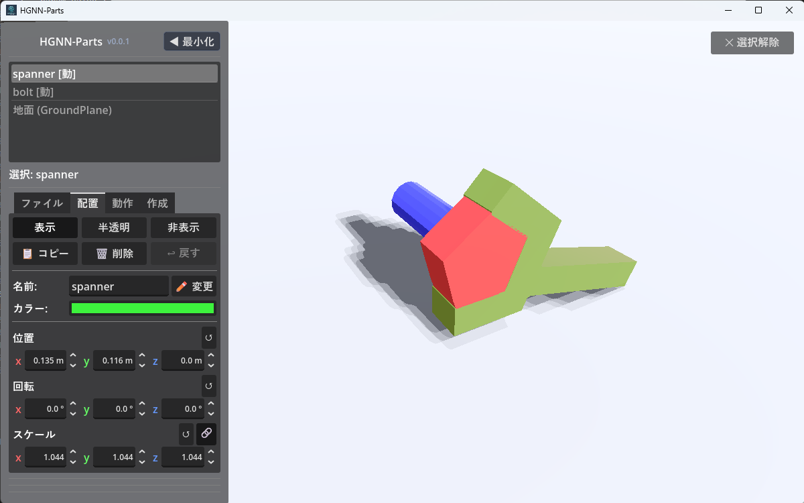
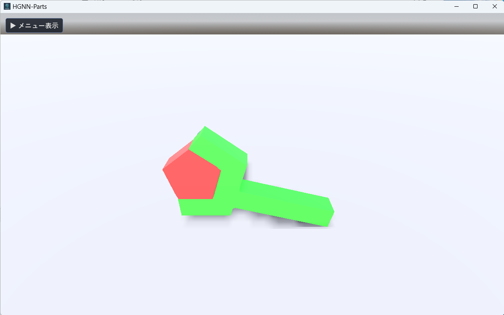
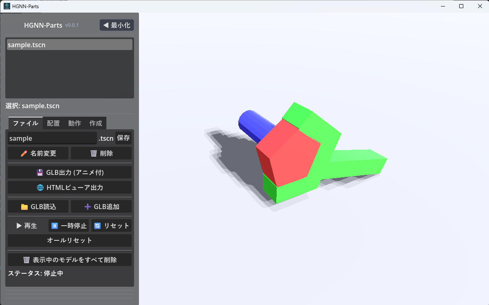
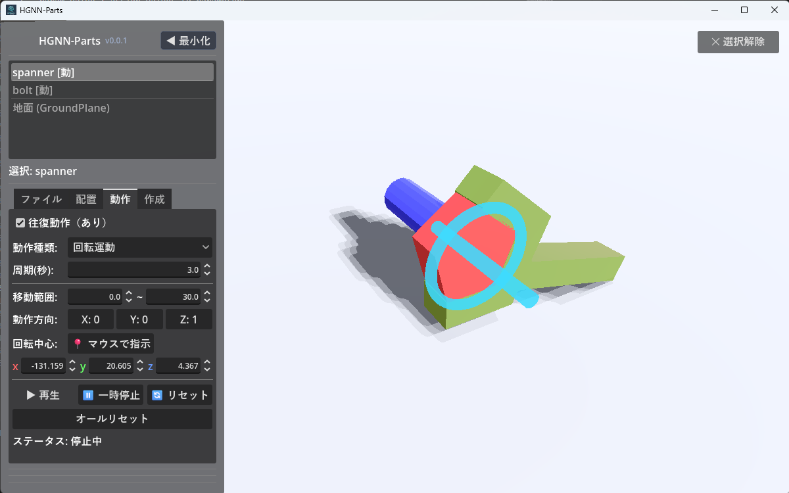
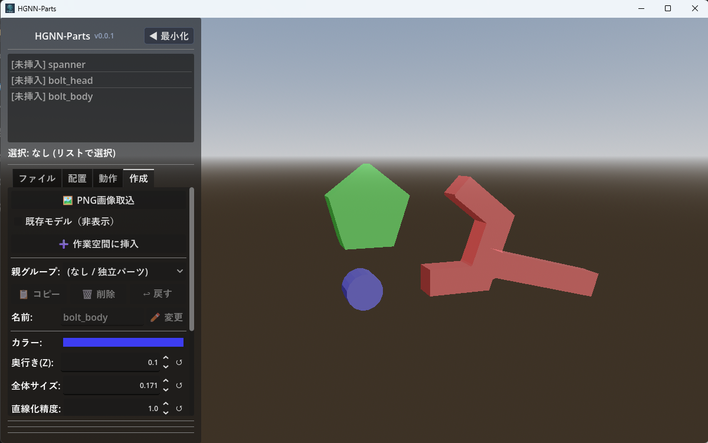

# HGNN-Parts 3Dパーツシミュレーター 詳細操作マニュアル (manual.md)

3Dモデル（.glb）の読み込み、PNG画像からの立体パーツ自動生成、パーツの配置・色変更、回転や直線運動のアニメーション付与、および3D画面の操作説明です。

> 💡 **実際の作業フロー順に沿ったガイドをお探しの場合**:  
> 「新規シーン作成 〜 PNG取込 〜 配置・動作設定 〜 保存・読込」の一連の手順をステップバイステップで確認したい場合は、**[操作手順書 (operation.md)](operation.md)** をご覧ください。

---

## 📑 目次

1. [画面全体の基本レイアウト](#1-画面全体の基本レイアウト)
2. [画面共通の操作・便利機能](#2-画面共通の操作便利機能)
   - [メニューの最小化・展開](#メニューの最小化展開)
   - [パーツの選択と選択解除](#パーツの選択と選択解除)
   - [3D画面（ビューポート）のマウス操作一覧](#3d画面ビューポートのマウス操作一覧)
3. [【ファイル】タブの操作説明](#3-ファイルタブの操作説明)
   - [シーンの保存と管理（TSCN）](#シーンの保存と管理tscn)
   - [ファイル出力（エクスポート）](#ファイル出力エクスポート)
   - [3Dモデルの取込・追加](#3dモデルの取込追加)
   - [シミュレーション再生コントロール](#シミュレーション再生コントロール)
4. [【配置】タブの操作説明](#4-配置タブの操作説明)
   - [パーツ一覧リストと状態表示](#パーツ一覧リストと状態表示)
   - [表示・半透明・非表示の切り替え](#表示半透明非表示の切り替え)
   - [パーツのコピー・削除・元に戻す](#パーツのコピー削除元に戻す)
   - [パーツ名とカラーの変更](#パーツ名とカラーの変更)
   - [位置・回転・スケール（3D変形）の調整](#位置回転スケール3d変形の調整)
   - [作成タブからのパーツ削除と作成タブへの自動復帰](#作成タブからのパーツ削除と作成タブへの自動復帰)
5. [【動作】タブの操作説明](#5-動作タブの操作説明)
   - [動作タイプ（回転・直線）の選択](#動作タイプ回転直線の選択)
   - [往復動作・周期（秒）・移動範囲の設定](#往復動作周期秒移動範囲の設定)
   - [動作方向（軸）の指定](#動作方向軸の指定)
   - [回転中心位置の指定（📍マウスで指示）](#回転中心位置の指定マウスで指示)
   - [シミュレーションの再生確認](#シミュレーションの再生確認)
6. [【作成】タブの操作説明（PNG画像から3Dパーツ生成）](#6-作成タブの操作説明png画像から3dパーツ生成)
   - [画像取込と下書きパーツリスト（未挿入管理）](#画像取込と下書きパーツリスト未挿入管理)
   - [下書きパーツの名前変更](#下書きパーツの名前変更)
   - [下書きパーツのコピー・削除・元に戻す](#下書きパーツのコピー削除元に戻す)
   - [立体化パラメータの調整（厚み・サイズ・精度・カラー）](#立体化パラメータの調整厚みサイズ精度カラー)
   - [下書きの位置・回転・スケール（3D変形）の事前調整](#下書きの位置回転スケール3d変形の事前調整)
   - [グループ設定と一括挿入機能](#グループ設定と一括挿入機能)
   - [3D画面上での直接選択と配置タブとの双方向同期](#3d画面上での直接選択と配置タブとの双方向同期)
7. [キーボードショートカット一覧](#7-キーボードショートカット一覧)

---

## 1. 画面全体の基本レイアウト

画面は大きく分けて2つの領域で構成されています：

- **左側：操作パネル（メニュー）**
  - 最上部：タイトルバー（アプリケーション名 `HGNN-Parts`、バージョン `v0.0.1`、`◀ 最小化` ボタン）
  - 上部：タブに応じた一覧リスト（`ファイル`タブ選択時はシーン一覧、`配置`/`動作`タブ時はパーツ一覧、`作成`タブ時は作成パーツ一覧）および選択中パーツ名ラベル
  - 中央：**4つの機能タブ**（`ファイル` / `配置` / `動作` / `作成`）
  - 下部：シミュレーション再生コントロール、ステータス表示
- **右側：3Dビューポート（作業空間）**
  - 読み込んだ3Dモデルやパーツが立体表示されるメイン画面です。
  - 右上：`✕ 選択解除` ボタン（選択解除しないと他のパーツを選択できません）

---

## 2. 画面共通の操作・便利機能

### メニューの最小化・展開

作業中に3Dモデルを画面全体で広く確認したいときに利用します。

- **`◀ 最小化` ボタン**:
  - メニュー最上部右側のボタンをクリックすると、メニューが左側へスムーズにスライドアウトして最小化されます。
  - **ショートカットキー**: **`M` キー** を押すだけでも最小化できます（テキスト入力中を除く）。
- **`▶ メニュー表示` ボタン**:
  - 最小化中は、画面左上にフローティングボタンとして表示されます。
  - クリックする（または再度 **`M` キー** を押す）と、メニューが元の位置に展開されます。
  - ※メニュー最小化中は、画面左端を含めた全画面でカメラ回転やパーツのダイレクト操作が可能です。

### パーツの選択と選択解除
- **パーツの選択**:
  - 3D画面上のパーツを **左クリック** すると、そのパーツが選択状態になり、メニューのパーツ一覧でもハイライトされます。
  - 一覧リスト上でパーツ名をクリックすることでも選択できます。`Ctrl` や `Shift` を押しながらクリックすることで複数選択も可能です。
- **`✕ 選択解除` ボタン**:
  - 3D画面の右上に表示されるボタンです。
  - クリックすると、現在選択されているすべてのパーツの選択が解除されます（背景の何もない場所をクリックすることでも解除できます）。

### 3D画面（ビューポート）のマウス操作一覧

| 操作 | マウス入力 | 説明 |
| :--- | :--- | :--- |
| **視点の回転 (オービット)** | **左ドラッグ** | モデルを中心にカメラを自由な角度に旋回させます。 |
| **視点の平行移動 (パン)** | **右ドラッグ** | 画面の上下左右に視点をスライド移動します。 |
| **ズームイン / ズームアウト** | **マウスホイール回転 (スクロール)** | 視点を近づけたり遠ざけたりします。 |
| **パーツの3Dダイレクト移動** | **`Shift` キー + 左ドラッグ** | 選択中のパーツを、視線に垂直な平面上で直感的にドラッグ移動できます（複数選択時は連動）。 |
| **パーツの選択** | **左クリック** | クリックしたパーツを選択します。選択解除しないと別のパーツを選択できません。 |

---

## 3. 【ファイル】タブの操作説明

主にシミュレーション全体の保存、モデルファイルの読み込み、エクスポート、再生制御を行います。

### シーンの保存と管理（TSCN）
本ソフトでは、パーツの配置や動作設定を Godot のシーン形式（`.tscn`）として保存・管理します。

- **シーン一覧リスト（上部リスト）**:
  - 保存フォルダ内にある `.tscn` ファイルが一覧表示されます。
  - リストの項目をクリックすると、そのシーンへ切り替わります（未保存の変更がある場合は確認メッセージが表示されます）。
- **名前入力欄 & `保存` ボタン**:
  - 例: `[ sample ] .tscn` `[ 保存 ]`
  - 新しい名前を入力して「保存」を押すと新規ファイルとして保存されます。既存ファイル名の場合は上書き保存されます。
- **`✏️ 名前変更` ボタン**:
  - リストで選択中の `.tscn` ファイルの名前を変更します。
  - 入力欄に新しい名前を入力してからこのボタンを押します。
  - > ⚠️ **重要**: ファイル名の変更は、必ず本機能（アプリ内の `✏️ 名前変更` ボタン）から行ってください。OSのエクスプローラー等で直接ファイル名を変更すると、自動読み込み記憶が追従せず、起動時に別のファイルが開かれる原因になります（アプリ内でリネームした場合は自動追従します）。
- **`🗑️ 削除` ボタン**:
  - 選択中の `.tscn` ファイルをパソコン上から完全に削除します（確認ダイアログが表示されます）。

### ファイル出力（エクスポート）
- **`💾 GLB出力 (アニメ付)`**:
  - 設定したすべてのパーツの動き（回転や直線動作）をキーフレームアニメーションとしてベイク（焼き込み）し、単一の **`.glb`** 3Dモデルファイルとして保存します。
  - Blender や他の3Dソフト、Web（Three.js 等）でそのまま動く標準形式です。
- **`🌐 HTMLビューア出力`**:
  - インターネットブラウザ（Chrome, Edge 等）でダブルクリックするだけで動く、スタンドアローンの **`.html`** ファイルとして保存します。
  - 特別なソフトをインストールしていない相手にも、3Dシミュレーションを簡単に共有できます。

### 3Dモデルの取込・追加
- **`📁 GLB読込`**:
  - パソコン内の `.glb` ファイルを選択して新規読み込みします（現在の作業空間はクリアされます）。
- **`➕ GLB追加`**:
  - 現在表示されているパーツを消さずに、別の 3Dモデルを追加で読み込みます。複数の装置や部品を組み合わせる際に使用します。

### シミュレーション再生コントロール
- **`▶ 再生`**: パーツに設定されたアニメーションを一斉に開始します。
- **`⏸ 一時停止`**: 現在の位置で動きを一時ストップします。再度「再生」を押すと続きから動きます。
- **`🔄 リセット`**: すべてのパーツの動作位置を最初の状態（0秒時点）に戻します。
- **`オールリセット`**:
  - パーツの配置移動や変形、設定をすべてモデル読み込み時の初期状態へ戻します。
- **`🗑️ モデルをすべて削除`**:
  - 作業空間にあるパーツ、および【作成】タブの作成中パーツ（下書き）も含めてすべて削除し、空の状態にします。
- **`ステータス: 停止中 / 再生中`**:
  - 現在のシミュレーション稼働状態を表示します。

---

## 4. 【配置】タブの操作説明

読み込んだパーツの場所（位置・回転・大きさ）、色、可視状態を個別に調整するタブです。

### パーツ一覧リストと状態表示
- **パーツリスト**:
  - モデルに含まれるパーツが一覧表示されます。クリックで個別選択できます（`Ctrl` / `Shift` で複数選択も可能）。
  - パーツ名の右に **`[動]`** と表示されている場合、そのパーツには「動作（回転または直線）」が設定されていることを示します。
  - リスト最下部にある **`地面 (GroundPlane)`** を選択すれば、床面自体の調整も可能です。

### 表示・半透明・非表示の切り替え
選択したパーツの見た目をワンクリックで切り替えます：
- **`[ 表示 ]`**: 通常の不透明状態で表示します。
- **`[ 半透明 ]`**: パーツを半透明（ゴースト表示）にします。内部を透かして見たいときに便利です。
- **`[ 非表示 ]`**: パーツを見えないようにします。

### パーツのコピー・削除・元に戻す
- **`📋 コピー`**: 選択したパーツを同じ場所に複製します。重なっているので、パーツを選択しなおして移動してください。同じ部品を複数並べたいときに使用します。
- **`🗑️ 削除`**: 選択したパーツを作業空間から取り除きます。
- **`↩ 戻す`**: 直前に削除したパーツを元の位置に復元します（誤って消してしまった場合の安全機能）。

### パーツ名とカラーの変更
- **名前:** `[ パーツ名入力欄 ]` `[ ✏️ 変更 ]`:
  - パーツの名称を変更して整理できます（`Enter` キーでも確定可能）。
- **カラー:** `[ カラーパレットバー ]`:
  - カラーバーをクリックするとカラーピッカーが開き、パーツの色を自由に変更できます。

### 位置・回転・スケール（3D変形）の調整
X・Y・Z の各軸に対して位置・回転・スケールを設定できます。

> 💡 **便利なスピンボックスの操作法**  
> 数値入力欄は、数値を直接キーボードで打ち込むだけでなく、**左右にドラッグするだけで数値をスムーズに増減** できます。  
> - `Shift` キーを押しながらドラッグ：**10倍速** で変化  
> - `Ctrl` キーを押しながらドラッグ：**0.1倍速（微小変化）** で精密調整  

- **位置 (Position)**:
  - `X` (赤) / `Y` (緑) / `Z` (青) の座標を調整します。
  - **`↺` ボタン**: パーツの読み込み時の初期位置にリセットします。
- **回転 (Rotation)**:
  - `X` / `Y` / `Z` の各軸まわりの回転角度（度数法: 0°〜360°）を指定します。
  - **`↺` ボタン**: 角度を 0°（初期状態）にリセットします。
- **スケール (Scale)**:
  - パーツの倍率（1.0 = 原寸）を指定します。
  - **`🔗` (比率連動ボタン)**:
    - オンにすると、X / Y / Z のいずれかを変更した際に他の2軸も同じ比率で拡大縮小されます。
  - **`↺` ボタン**: スケールを 1.0 にリセットします。

### 作成タブからのパーツ削除と作成タブへの自動復帰
【作成】タブから作業空間へ挿入したパーツを、後から【配置】タブの「🗑️ 削除」で削除した場合、自動的に **【作成】タブ側のリストに「[未挿入]」として復帰** させます。  
これにより、「一度作業空間に挿入したが、再度別のグループに入れ直したい」「下書きのパラメータを再調整して挿入し直したい」といった作業がスムーズに行えます。

---

## 5. 【動作】タブの操作説明

パーツを選択し、クルクル回る「回転運動」やまっすぐ進む「直線運動」を設定するタブです。

### 動作タイプ（回転・直線）の選択
- **`動作種類:` ドロップダウンメニュー**:
  - **`動作なし`**: 動きをつけずに静止させます。
  - **`回転`**: 軸を中心にパーツを回転させます（歯車、ファン、アームなど）。
  - **`直線`**: 一定の方向にパーツをスライド移動させます（ピストン、スライダー、シリンダーなど）。

### 往復動作・周期（秒）・移動範囲の設定
- **`☑ 往復動作 (あり)`**:
  - チェックを入れると、開始点から終了点まで動いた後、逆再生のように元の位置へ戻る動き（振り子運動、往復運動）を繰り返します。
  - チェックを外すと、終了点まで達した後に最初から一方向に繰り返します（360度連続回転など）。
- **`周期(秒):`**:
  - 1往復（または1周）にかかる時間を秒単位で指定します（数値を小さくすると高速に、大きくするとゆっくり動きます）。
- **`移動範囲:` `[ 最小値 ] 〜 [ 最大値 ]`**:
  - **回転の場合**: 開始角度から終了角度までを「度（°）」で指定します（例: `0.0` 〜 `360.0` で1回転、`0.0` 〜 `90.0` で直角スイング）。
  - **直線の場合**: 移動する距離を指定します（例: `0.0` 〜 `50.0` の範囲で移動）。

### 動作方向（軸）の指定
- **`動作方向:` `[ X: 1 ]` `[ Y: 1 ]` `[ Z: 1 ]`**:
  - 動かす主軸（X軸・Y軸・Z軸）を選択・指定します。ボタンをクリックして軸を切り替えます。

### 回転中心位置の指定（📍マウスで指示）
回転動作を行う場合、「どの位置を中心にして回すか」が非常に重要です。

- **`📍 マウスで指示` ボタン**:
  1. このボタンをクリックすると指示モードになります。
  2. 3D画面上の回したいパーツの穴の中心や軸端面、角を **左クリック** します。
  3. クリックした地点の座標が自動的に下の X / Y / Z 座標にセットされ、その位置を中心にパーツが回転するようになります。
- **中心座標の数値スピンボックス**:
  - `X` / `Y` / `Z`で回転中心の位置を直接微調整することもできます。

### シミュレーションの再生確認
- 下部の **`▶ 再生`** / **`⏸ 一時停止`** / **`🔄 リセット`** ボタンで、設定した動きが期待通りに再現されるか確認できます。

---

## 6. 【作成】タブの操作説明（PNG画像から3Dパーツ生成）

黒いシルエットやイラストが描かれた 2D の PNG 画像を読み込むだけで、自動的に輪郭を検出して厚みを持った 3Dパーツ（メッシュ）を自動生成できる機能です。

### 画像取込と下書きパーツリスト（未挿入管理）
- **`🖼️ PNG画像取込` ボタン**:
  - ファイルダイアログが開き、パソコン内の PNG 画像（`.png`）を選択して読み込みます。
  - 画像内の黒い塗りつぶし形状を自動トレースし、複数のパーツがあれば個別の下書きとして抽出されます。
- **上部リスト（作成パーツ一覧）**:
  - 生成された下書きパーツ（例: `[未挿入] parts_1`, `[未挿入] parts_2`）がリストアップされます。
  - **未挿入管理仕様**: 作業空間に挿入済みのパーツはリストから自動的に隠れ、**現在まだ挿入されていない未挿入パーツだけが表示されます**。作業が進むにつれて一覧がすっきり整理されます。

### 下書きパーツの名前変更
- **名前:** `[ パーツ名入力欄 ]` `[ ✏️ 変更 ]`:
  - 対象の下書きパーツを選択し、名前欄に入力して変更ボタン（または `Enter`）を押すと名前が更新されます。

### 下書きパーツのコピー・削除・元に戻す
- **`📋 コピー`**: 選択した下書きパーツを複製します。同じ形状の下書きを増やしたいときに使用します。
- **`🗑️ 削除`**: 不要な下書きパーツをリストおよびプレビューから削除します。
- **`↩ 戻す`**: 直前に削除した下書きパーツを元に戻します。

### 立体化パラメータの調整（厚み・サイズ・精度・カラー）
選択した下書きパーツの形状パラメータをスライダー/スピンボックスで調整します：
- **`カラー:`**: パーツの材質色を設定します。
- **`奥行き(Z):` `[ 0.1 ]` `↺`**:
  - 押し出しの厚み（Z方向の厚さ）を設定します。板金パーツやアクリル板のような厚みをミリ単位で指定できます。
- **`全体サイズ:` `[ 1.0 ]` `↺`**:
  - パーツ全体のスケール（倍率）を調整します。
- **`直線化精度:` `[ 1.0 ]` `↺`**:
  - 輪郭をポリゴン化する際の精度（単純化の許容誤差）です。数値を小さくすると原画に忠実な細かい曲線になり、大きくすると直線的で軽量な形状になります。

### 下書きの位置・回転・スケール（3D変形）の事前調整
作業空間へ挿入する前の段階から、下書きパーツの位置や向きを細かく合わせられます：
- **位置 (Position)**: X / Y / Z 座標の調整およびリセット。
- **回転 (Rotation)**: X / Y / Z 軸まわりの回転角度の調整およびリセット。
- **スケール (Scale)**: X / Y / Z 倍率の調整、**`🔗` 比率連動**、リセット。

### グループ設定と一括挿入機能
- **`既存モデル (非表示)` チェックボックス**:
  - チェックを入れると、すでに画面上にある他のパーツを一時的に隠し、作成中のパーツだけに集中して形状確認できます。
- **`グループ:` ドロップダウンメニュー**:
  - `(なし / 独立パーツ)`、または既存のグループを選択します（新規グループ作成時は `➕ 新規追加`）。
  - 複数の下書きパーツを1つのグループ配下にまとめて構造化できます。
- **`➕ 作業空間に挿入` ボタン**:
  - **単体パーツ選択時**: 選択中の下書きパーツを作業空間へ挿入します。
  - **グループ選択時**: **そのグループに属する未挿入パーツが一括でまとめて作業空間に挿入されます**。
  - グループ配下のパーツがすべて挿入されると、グループ自体も作成タブの一覧から自動的に隠れます。

### 3D画面上での直接選択と配置タブとの双方向同期
- **3D画面上での下書き選択**:
  - 作成タブ表示中は、3Dビュー上でプレビュー表示されている下書きパーツを直接 **左クリック** して選択できます。
- **配置タブとの双方向同期**:
  - 作業空間へ挿入したパーツを後から【配置】タブで削除した場合、作成タブ側のリストに「[未挿入]」として自動復帰します。【配置】タブで「↩ 戻す」を押せば再び挿入済みに戻ります。

---

## 7. キーボードショートカット一覧

| キー | 機能 | 説明 |
| :--- | :--- | :--- |
| **`M`** | **メニュー最小化 / 展開** | 左側メニューをワンキーで折りたたみ・復元します（文字入力中を除く）。 |
| **`Shift` + 左ドラッグ** | **パーツの3Dダイレクト移動** | 選択パーツを3D画面上で視線平面に沿って直接マウス移動させます。 |
| **スピンボックス操作 + `Shift`** | **10倍速入力** | 数値ドラッグ時の変化量を10倍にします。 |
| **スピンボックス操作 + `Ctrl`** | **0.1倍速入力** | 数値ドラッグ時の変化量を1/10にして精密に調整します。 |
