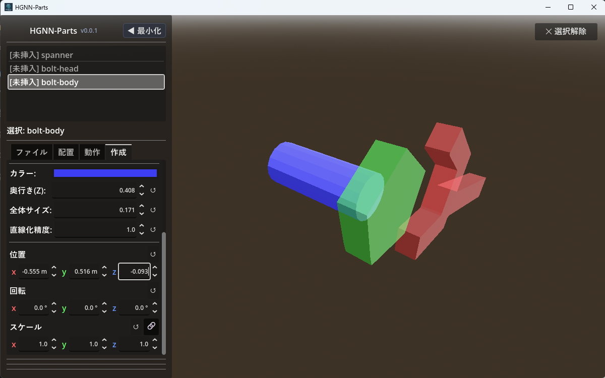
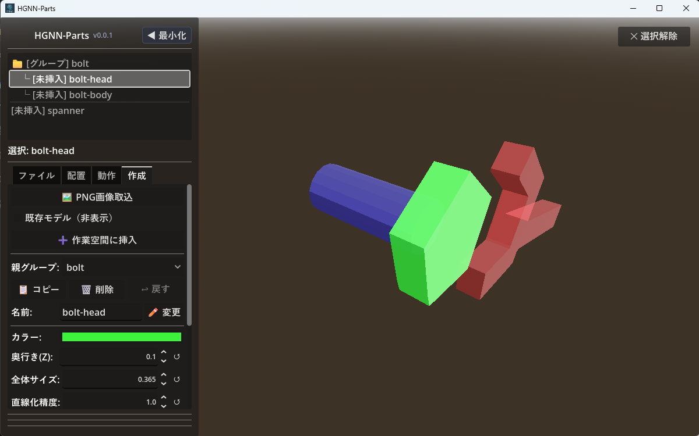
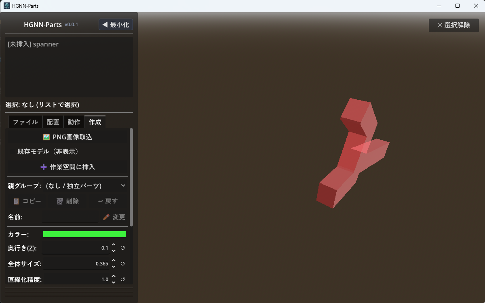
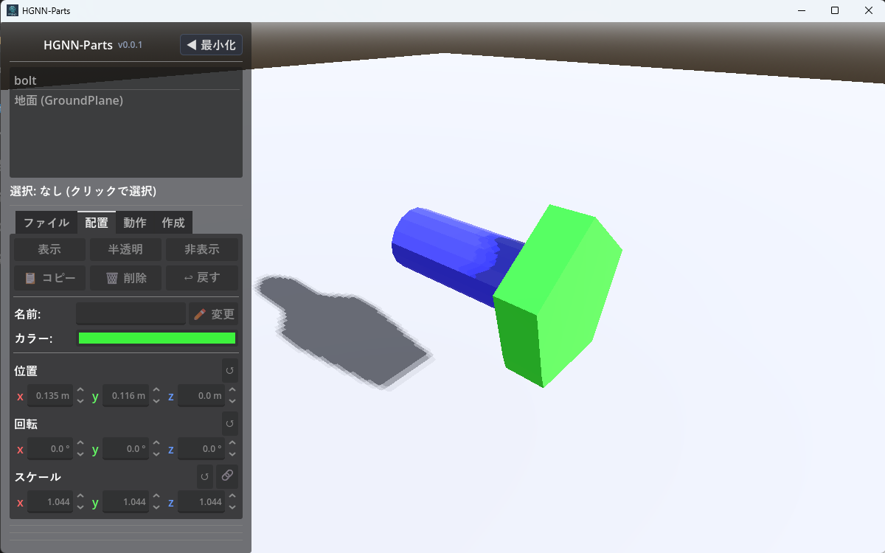

# HGNN-Parts 操作手順（PNG取込 〜 配置・動作設定 〜 保存/読込）

ここでは「新規シーンを作る → PNG画像からパーツを作成する → 配置と動作を設定する → 各形式で保存する → 読み込み直す」までの一連の操作を、実行順に沿ってまとめたものです。各ボタンの詳細な仕様や機能一覧は [詳細操作マニュアル (manual.md)](manual.md) を参照してください。

---

## 1. 新規にシーンをクリアする

1. 左側メニューの **「ファイル」タブ** を開きます。
2. **「🗑️ モデルをすべて削除」** ボタンを押します。
   - 作業空間にあるパーツ、および【作成】タブの作成中パーツ（下書き）がすべて削除され、空の状態になります。
   - 未保存の変更がある場合は確認メッセージが表示されるので、内容を確認してから続行してください。
3. ファイルの名前を変更して保存します。この名前で新しく作成していきます。

> 💡 空の状態から新しく `.tscn` として保存したい場合は、後述の「9. TSCNとして保存する」の手順で新規ファイル名を指定して保存します。

---

## 2. PNG画像（parts.png）を読み込む
pngファイル

1. 左側メニューの **「作成」タブ** を開きます。
2. **「🖼️ PNG画像取込」** ボタンを押し、ファイルダイアログから `parts.png` などの画像ファイルを選択します。
3. 画像内の黒い塗りつぶし形状が自動トレースされ、上部の「作成パーツ一覧」に下書きパーツ（例: `[未挿入] parts_1`）としてリストアップされます。
4. 一覧でパーツをクリックする、または3D画面上の下書き形状を直接 **左クリック** すると、対象パーツが選択されてハイライト表示されます。

---

## 3. 立体化パラメータと位置・形状を調整する

下書きパーツを選択した状態で、以下のパラメータを調整します：

- **立体化パラメータ**:
  - **`カラー:`** — パーツの材質色を設定します。
  - **`奥行き(Z):`** — 押し出しの厚み（Z方向、ミリ単位）を設定します。
  - **`全体サイズ:`** — パーツ全体のスケール（倍率）を調整します。
  - **`直線化精度:`** — 輪郭単純化の許容誤差です。数値を小さくすると原画に忠実、大きくすると直線的で軽量な形状になります。
- **配置パラメータ（下書きの位置・回転・スケール）**:
  - 作業空間へ挿入する前の段階で、**位置 (X/Y/Z)**、**回転 (X/Y/Z)**、**スケール (X/Y/Z 🔗連動)** を細かく位置合わせできます。
  - 数値スピンボックスは直接入力のほか、**左右にドラッグ** して増減できます（`Shift` で10倍速、`Ctrl` で精密微小変化）。
- **下書きパーツの整理**:
  - **`📋 コピー`**: 選択した下書きパーツを複製します。
  - **`🗑️ 削除`**: 不要な下書きを削除します。
  - **`↩ 戻す`**: 直前に削除した下書きパーツを復元します。

3D画面でプレビューを確認しながら、必要な大きさや向きになるよう調整してください。

---

## 4. 名前を変更する

1. 下書きパーツ一覧から対象のパーツを選択します（または3D画面上でクリック）。
2. **名前:** 入力欄に新しい名前を入力します。
3. **`✏️ 変更`** ボタンを押すか、キーボードの `Enter` キーを押して確定します。

パーツごとに分かりやすい名前をつけておくと、この後の配置・動作設定の際に一覧で識別しやすくなります。

---

## 5. グループ化する（親子関係の設定）

複数の下書きパーツを1つの塊（アセンブリ）としてまとめて扱いたい場合に設定します。

1. 下書きパーツを選択した状態で、**「グループ:」ドロップダウン** を開きます。
2. 新しいグループを作る場合は **「➕ 新規追加」** を選択し、グループ名を入力します。
3. 既存のグループにまとめたい場合は、ドロップダウンから該当のグループ名を選択します。
4. 同じグループに入れたい他のパーツについても、同様にグループを選択します。

> グループ化しない場合は **「(なし / 独立パーツ)」** のままにしておきます。

---

## 6. 作業空間に挿入する

下書きパーツを、正式なシミュレーション空間（メインシーン）へ配置します。

1. **「既存モデル (非表示)」** チェックボックスを切り替えることで、すでに画面にある他のパーツを表示/一時非表示にして位置関係を確認できます。
2. **「➕ 作業空間に挿入」** ボタンを押します：
   - **単体パーツを選択している場合**: 選択した下書きパーツが作業空間へ挿入されます。
   - **グループを選択している場合**: **そのグループに属する未挿入パーツが一括でまとめて作業空間に挿入されます**。
3. **挿入後のリスト表示の変化**:
   - 挿入が完了したパーツは、作成タブの上部リストから自動的に取り除かれ、**まだ挿入されていない未挿入パーツだけがリストに残ります**（グループ配下のパーツがすべて挿入されると、グループ自体も非表示になります）。
   - 挿入されたパーツは、**【配置】タブ** および **【動作】タブ** のパーツ一覧に正式に追加され、自由に動かせるようになります。

> 💡 **便利な連携機能**:  
> 作業空間へ挿入したパーツを、後から【配置】タブで「🗑️ 削除」すると、**作成タブの作成パーツ一覧に「[未挿入]」として自動復帰** します。誤って消してしまった場合や、後から再挿入・再調整したい場合も安心です。

---

## 7. 配置（位置・回転・スケール）を調整する

1. 左側メニューの **「配置」タブ** を開きます。
2. パーツ一覧から、挿入したパーツを選択します（3D画面上のパーツを左クリックしても選択できます）。
3. **3Dビューでの直感操作**:
   - **視点の回転**: **左ドラッグ** でカメラを旋回。
   - **視点の平行移動 (パン)**: **右ドラッグ** で上下左右にスライド移動。
   - **ズーム**: **マウスホイール回転**。
   - **ダイレクト移動**: **`Shift` キー + 左ドラッグ** で、選択中のパーツを視線平面に沿って自由に移動できます。
4. **精密パラメータの調整**:
   - **位置 (Position)**: X / Y / Z の座標をドラッグまたは数値入力で調整します。
   - **回転 (Rotation)**: X / Y / Z 各軸まわりの回転角度（度数法: 0°〜360°）を指定します。
   - **スケール (Scale)**: 倍率を再調整します。**`🔗`（比率連動）** をオンにすると3軸均等に拡大縮小されます。
   - 各パラメータの **`↺` ボタン** を押すと、初期値へ即座にリセットされます。
5. **表示切り替え**:
   - **`[ 表示 ]`** / **`[ 半透明 ]`** / **`[ 非表示 ]`** でパーツの可視状態を切り替えられます。内部機構を確認したいときは半透明が便利です。

---

## 8. 動作（回転・直線）と回転中心を設定する

1. パーツを選択したまま、左側メニューの **「動作」タブ** を開きます。
2. **「動作種類:」ドロップダウン** から目的の動作を選択します：
   - **`回転`**: 軸まわりにパーツを回転させます（歯車、ファン、アームなど）。
   - **`直線`**: 一定方向にスライド移動させます（シリンダー、ピストンなど）。
3. パラメータを設定します：
   - **`☑ 往復動作`**: チェックを入れると往復運動（振り子、スイング）、外すと一方向への連続ループになります。
   - **`周期(秒):`**: 1周期にかかる時間を秒単位で指定します。
   - **`移動範囲:`**: 回転角度（度°）または直線移動距離（mm）を指定します。
   - **`動作方向:`**: 動かす主軸（X / Y / Z）をボタンで切り替えます。
4. **回転中心（ピボット）の指定（回転動作の場合）**:
   1. **「📍 マウスで指示」** ボタンをクリックします（指示モードになり、緑枠が点灯します）。
   2. 3D画面上で、回転の軸としたい穴の中心やシャフトの端面を **左クリック** します。
   3. クリックした地点の座標が自動的に回転中心欄（X / Y / Z）にセットされます。
   - 手動で微調整したい場合は、スピンボックスの数値を直接編集することもできます。
5. **動作の確認**:
   - 下部の **「▶ 再生」** ボタンを押して、期待通りにシミュレーションが動作するか確認します。
   - **「⏸ 一時停止」** で静止、**「🔄 リセット」** で開始時点の位置へ巻き戻せます。

---

## 9. TSCN・GLB・HTMLとして保存する

左側メニューの **「ファイル」タブ** を開き、目的に応じて保存します。

### TSCNとして保存（作業状態の完全保存）
1. 「ファイル」タブの名前入力欄にファイル名を入力します（例: `sample`）。
2. **「保存」** ボタンを押します。
   - すべてのパーツの配置座標、回転中心、動作アニメーション設定が Godot シーン形式（`.tscn`）で安全に保存されます。

### GLBとして保存（アニメーション付き3Dデータ）
1. **「💾 GLB出力 (アニメ付)」** ボタンを押します。
2. 設定した回転・直線動作がキーフレームアニメーションとして焼き込まれた、単一の `.glb` ファイルとしてエクスポートされます（Blenderや外部ビューアでそのまま動かせます）。

### HTMLビューアとして保存（ブラウザ共有用）
1. **「🌐 HTMLビューア出力」** ボタンを押します。
2. インターネットブラウザ（Google Chrome, Microsoft Edge など）でダブルクリックするだけで3Dアニメーションが動く、単独の `.html` ファイルとして保存されます。Godot等のソフトを持っていない相手への共有に最適です。

---

## 10. 保存したファイルを読み込む・管理する

### TSCNから読み込む
1. 「ファイル」タブ上部の **シーン一覧リスト** から、読み込みたい `.tscn` ファイルをクリックします。
2. 作業中のシーンに未保存の変更がある場合は確認ダイアログが表示されます。

### GLBから読み込む（外部3Dモデルの取込）
- **`📁 GLB読込`**: 既存の空間をクリアして、選択した `.glb` モデルを新しく読み込みます。
- **`➕ GLB追加`**: 現在表示されているパーツを残したまま、別の3Dモデルを追加で読み込んで組み合わせます。

### シーンの整理（名前変更・削除）
- **`✏️ 名前変更`**: シーン一覧リストでファイルを選択し、入力欄に新しい名前を入れてボタンを押すと安全にリネームされます。
- **`🗑️ 削除`**: 不要になった `.tscn` ファイルを削除します。

---

## ひとことメモ

- **前回の作業状態の自動復元**:  
  アプリは前回終了時に開いていたシーンを自動記憶しています。次回起動時はそのシーンが自動で開きます。
- **ファイル名変更時の注意**:  
  TSCNファイルの名前を変更する際は、必ずアプリ内の **「✏️ 名前変更」** ボタンを使用してください。エクスプローラー等で直接名前を変更すると、次回起動時の自動記憶が追従しない場合があります（アプリ内で変更した場合は設定も自動追従します）。
- **初期シーンの自動生成**:  
  保存フォルダ内に `.tscn` が1つも無い状態でアプリを起動した場合、安全のため自動的に「空の地上だけの `base.tscn`」が新規生成されます。
- **メニューの最小化ショートカット**:  
  キーボードの **`M` キー** を押すと、いつでも左側メニューを最小化して画面全体を広々と使えます。もう一度 `M` キーを押すと元に戻ります。
